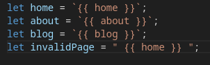
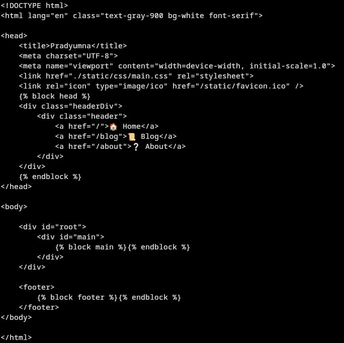
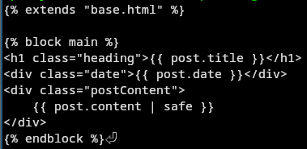
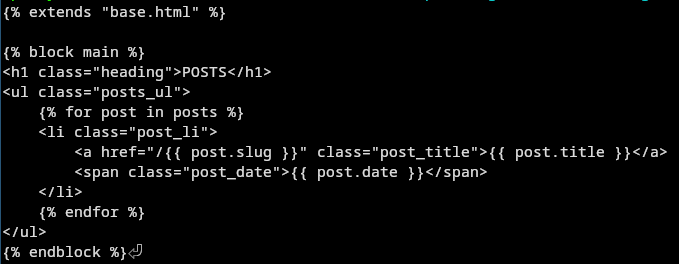

## Github Pages


`Warning in Advance`: This post is going to be very code heavy


If you don't know what Github Pages is, it is this cool feature offered by Github where they allow you to host static files right from your GitHub repository.

All we have to do is keep our HTML, CSS, and JavaScript files with an `index.html` in our repository (either in the `root/` folder or the `docs/` folder) and choose the Source in `/settings/pages` as `Deploy from a branch`. Each time we build, our website will be re-deployed (Though I have observed sometimes it doesn't update and you have to unpublish the site and deploy again to fix it).

Otherwise, if you want to get fancy, you can even run a build process using some workflow wizardry.


## But I wanna have routing!

I get it. 

`www.malladipradyumna.com/static-site-generator-for-github-pages.html` looks way uglier. 

Basically, we don't want the `.html`. We want to navigate to `/blog` to see all the posts instead of `/blog.html`.

## But how to do routing in a static site deployed to github pages?

There are two ways.

### Have a SPA (Single Page Application) and manage routing using `Javascript` and the `history API`

Add this [`router.js`](https://stackoverflow.com/a/67041356) to your `base.html`


Starting of `router.js` that doesn't render

Rest of the `router.js`
```javascript
let home = `{{ home }}`;
let about = `{{ about }}`;
let blog = `{{ blog }}`;
let invalidPage = " {{ home }} ";

const routes = {
    "/": home,
    "/about": about,
    "/blog": blog,
    default: invalidPage,
};

const render = path => {
    console.log('path: ' + path);
    const content = routes[path] || invalidPage;

    document.querySelector("#root").innerHTML = content;
};

// Add a single click event listener for all links that navigate within the site
document.addEventListener("click", evt => {
    const target = evt.target;
    if (target.tagName === "A" && target.getAttribute("href").startsWith("/")) {
        evt.preventDefault();
        const { pathname: path } = new URL(target.href);
        render(path);
        window.history.pushState({ path }, path, path);
    }
});

window.addEventListener("popstate", e => {
    render(new URL(window.location.href).pathname);
});

window.onload = function init() {
    render("/");
};
```

### The problems with this approach

This works only if the user clicks a button that redirects to say `/about` but doesn't work if the user opens say `www.malladipradyumna.com/about`! It will navigate to `404.html` on Gh-Pages! 

How to fix this?

One way is to use a script that automatically redirect to `index.html` or the route based on the url when the document is loaded. See this [Stackoverflow Question](https://stackoverflow.com/questions/36296012/is-there-a-configuration-in-github-pages-that-allows-you-to-redirect-everything) for more about this.

But this method is not perfect!

The browser will often give a very annoying popup before the redirect.


## What to do then?

As I was struggling I suddenly realized something!

Wait a minute! Don't I have two static websites running on Github Pages already! [Website](https://github.com/mssrprad/website) that uses SolidJS's `solid-start` router and [Website](https://malladipradyumna.com) that uses the Jekyll Static Site Generator!

After some inspection of the build directories, it was obvious that the Github Pages server was automatically rendering `route.html` for `/route`.

Both the websites were compiling/building a static html file for each route.


## Static Site Generator

Finally, we come to the Static Site Generator.

### Directory Structure

```
├── build.log
├── build.py
├── README.md
├── requirements.txt
├── src
│   ├── about.html
│   ├── base.html
│   ├── blog.html
│   ├── index.html
│   ├── input.css
│   ├── post.html
│   ├── _posts
│   ├── _site
│   └── static
├── tailwind.config.js
```

### `base.html`

Sorry am not able to render the html inside the code block due to some markdown conversion issues. Attaching a screenshot for now.



Note that we are using [`jinja2`](https://jinja.palletsprojects.com/en/3.1.x/templates/) templating syntax. You must have encountered it if you have ever worked with `flask` or `django` libraries.


It makes the rendering of various different pages from our markdown/yaml content much easier.


### `post.html` and `blog.html`






### Rendering each individual page

We load the content from say `home.md` and convert to markdown and render into `home.html` inside the `docs/` directory.

`home.md`
```markdown
---
title: Home
layout: Post
tags: null
description: null
---

---

## Navigation:

- Head over to /about to know more about me
- Head over to /blog to read my posts

---
```


`build.py`
```python
# Get Home Page
home = None
try:
    home = frontmatter.load(home_path)
    logger.debug("home.md successfully loaded")
except Exception as e:
    logger.error("Failed to load home.md: %s", str(e))

# Build index in docs
page_index = None
with open("./src/index.html", "r") as file:
    page_index = file.read()

template_index = env.from_string(page_index)
rendered_index = template_index.render(home=markdown.markdown(home.content))

with open("./docs/index.html", "w") as file:
    file.write(rendered_index)
    logger.debug("index.html successfully built and saved")

with open("./docs/404.html", "w") as file:
    file.write(rendered_index)
    logger.debug("404.html successfully built and saved")
```


We do this kind of thing for each page.

### Rendering each individual post and blog.html

Let's say we have posts like this: `_posts/06-11-2023-Demo.md`

`build.py`
```
posts = []
try:
    for filename in os.listdir(posts_path):
        if filename.endswith(".md"):  # Assuming your posts are Markdown files
            post_path = os.path.join(posts_path, filename)
            with open(post_path, "r") as post_file:
                posts.append({post_path: frontmatter.load(post_file)})
    logger.debug("Posts successfully loaded")
except Exception as e:
    logger.error("Failed to load the posts from _posts: %s", str(e))

page_blog = None
post_keys = []

for i in posts:
    input_string = [a for a in i.keys()][0]
    post_keys.append(
        (
            input_string.split("/")[-1]
            .split(".md")[0]
            .split("-", 3)[-1]
            .replace("-", " "),
            "-".join(input_string.split("/")[-1].split(".md")[0].split("-")[:3][::-1]),
            input_string,
        )
    )

logger.debug("Post keys generated")


def get_postcontent(path):
    with open(path, "r") as file:
        return markdown.markdown(frontmatter.load(file).content)


post_data = [
    {
        "title": pk[0],
        "date": pk[1],
        "slug": pk[0].replace(" ", "-"),
        "content": get_postcontent(pk[2]),
    }
    for pk in post_keys
]

post_data = sorted(post_data, key=lambda x: x["date"], reverse=True)


logger.debug("Post data generated")

with open("./src/blog.html", "r") as file:
    page_blog = file.read()
    logger.debug("blog.html content loaded")

template_blog = env.from_string(page_blog)
rendered_blog = template_blog.render(posts=post_data)

with open("./docs/blog.html", "w") as file:
    file.write(rendered_blog)
    logger.debug("blog.html successfully built and saved")

logger.info("No Build Errors!............")

# Build each post
with open("./src/post.html", "r") as file:
    page_post = file.read()
    template_post = env.from_string(page_post)

for post in post_data:
    rendered_post = template_post.render(post=post)
    post_slug = post["slug"]
    with open(f"./docs/{post_slug}.html", "w") as file:
        file.write(rendered_post)
        logger.debug(f"{post_slug}.html successfully built and saved")

# Copy static folders/files to docs
shutil.copytree("./src/static", "./docs/static", dirs_exist_ok=True)
logger.debug("static files copied to docs")
```

## Simulating the Github Pages server using a simple flask server

As I mentioned above, the Github Pages server will automatically render `/route.html` for `/route`.

But, our simple `python -m http.server 8000` will not do that!

A simple workaround is to use a simple Flask Server to simulate this Github Pages environment.

```python
from flask import Flask, render_template, send_from_directory

# Initialize Flask app
app = Flask(__name__, template_folder=".", static_folder="./static")
app.root_path = app.root_path + "/docs"

# Start the dev server
@app.route("/")
@app.route("/<route>")
def serve_html(route="index"):
    return render_template(f"{route}.html")


if __name__ == "__main__":
    logger.debug("Development server started")
    app.run(debug=True)
```


## End

As I've made the site, I learnt that the biggest difficulty was designing the frontend not all this scripting work. Making a static site generator is not so difficult especially since you have so many examples that you can reverse engineer.s

More than half the effort was spent in making the site look at least 'not hideous'.

I don't know why frontend development is said to be 'easy'. I find it to be the most challenging part of web development.

Maybe because frontend optimization is not so important (or rather so costly)...


## Hope you enjoyed the post!