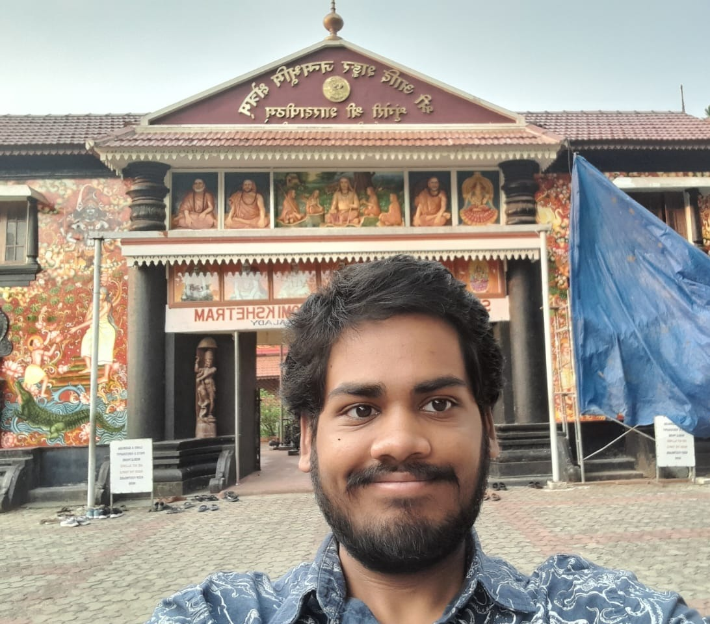

### Something about me

{: width="360px"}{: height="324px"}

I am Pradyumna, a third year undergraduate computer science student studying in the Birla Institute of Science and Technology in Hyderabad, India. I wish to learn some technical stacks that have a great future in the industry.

As for what I am doing currently, I am trying to get better at Python and Rust and also (unwillingly) learning a bit of DSA and Javascript on the side.

**_Interests (in no particular order):_**

- Machine Learning
- Modern Fullstack Web Development
- Linux
- NLP
- Rust & Python

**_Some relevant courses I have pursued in college:_**
- Machine Learning
- Data Structures and Algorithms
- Object Oriented Programming
- Database Management Systems